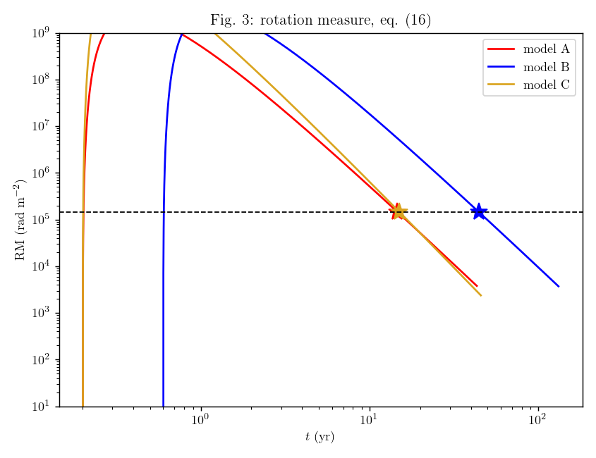
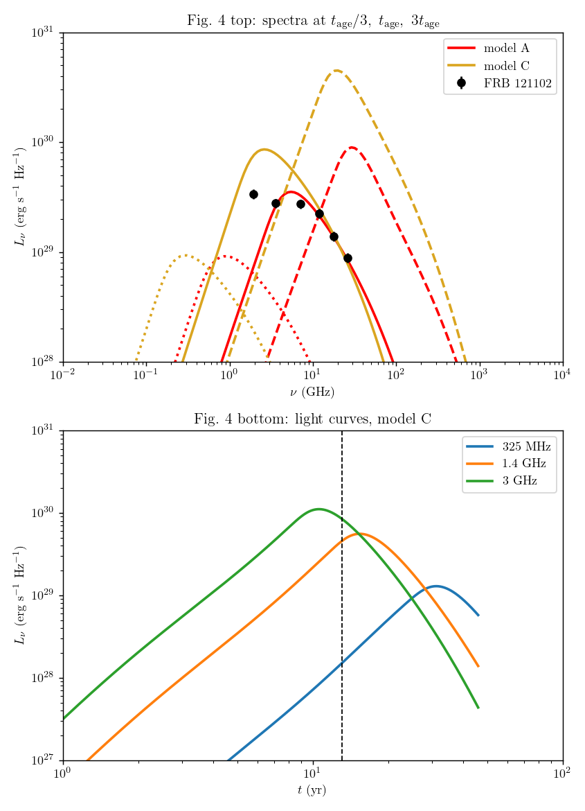
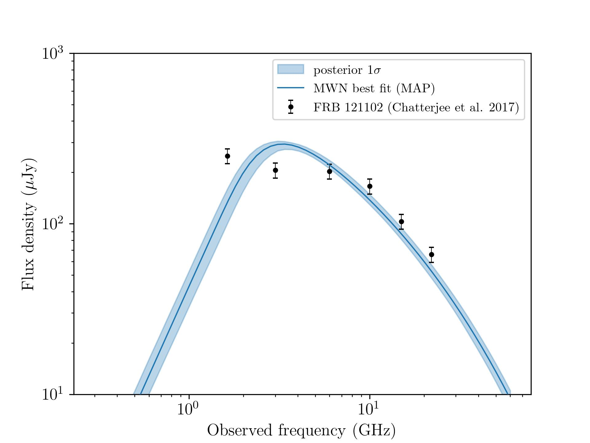
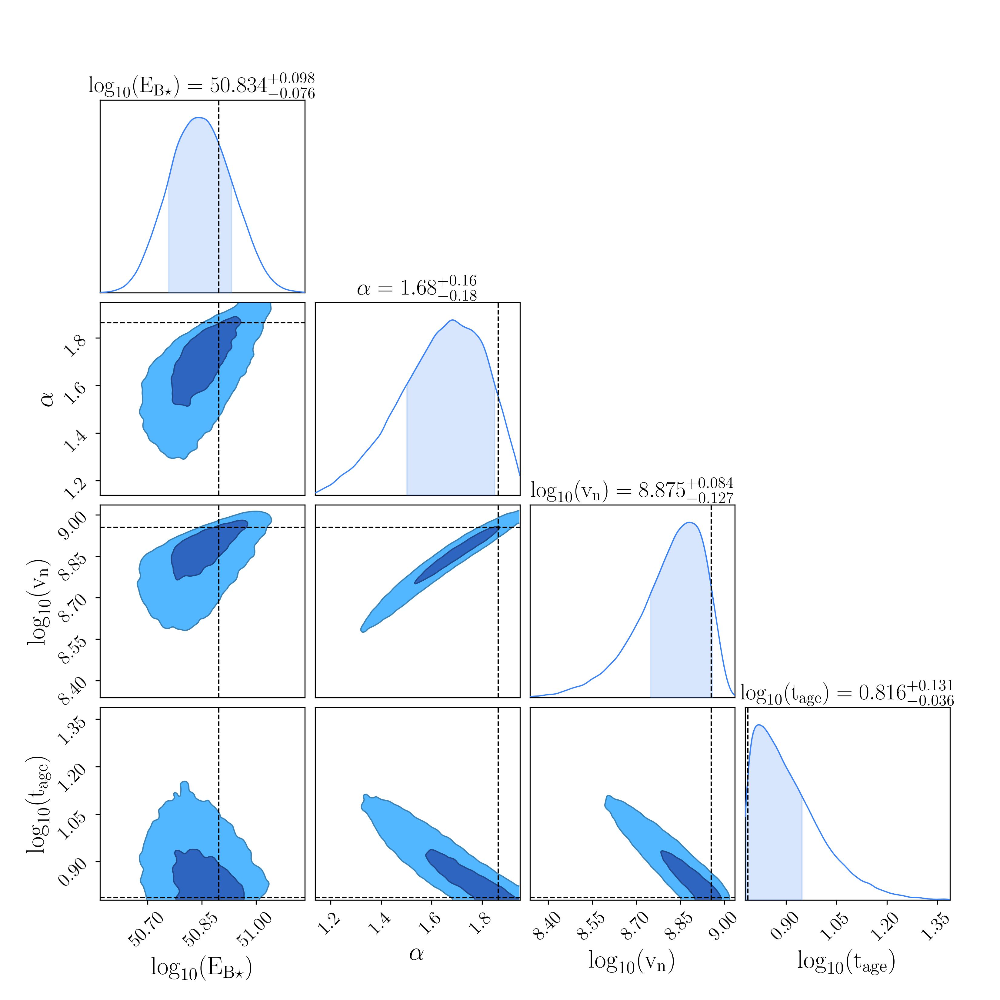
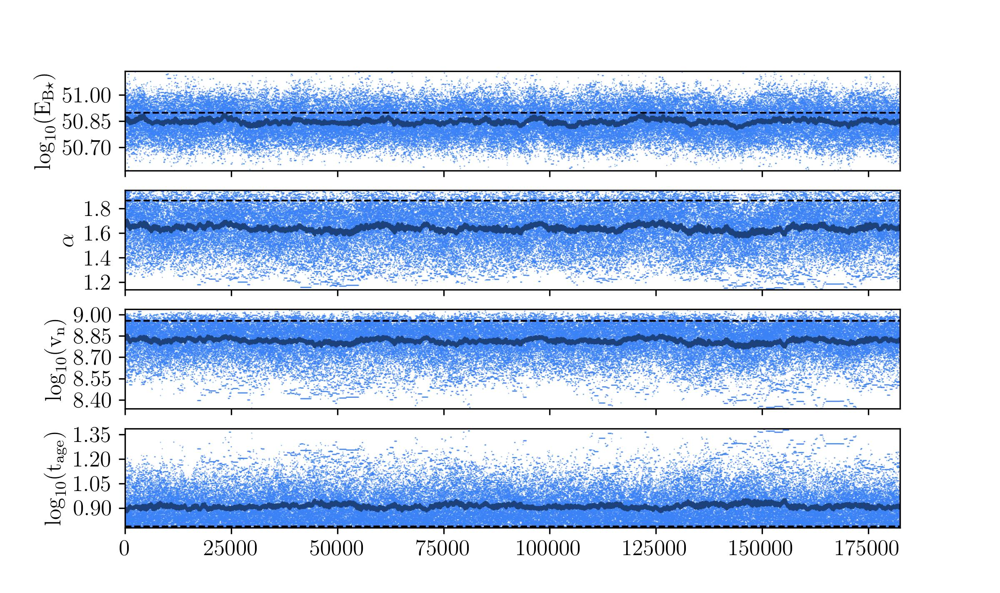

# Magnetar Wind Nebula Model

Python implementation of the synchrotron self-absorbed (SSA) magnetized ion–electron
wind nebula model of
[Margalit & Metzger 2018, ApJL 868, L4](https://iopscience.iop.org/article/10.3847/2041-8213/aaedad)
([arXiv:1808.09969](https://arxiv.org/abs/1808.09969)).

A flaring magnetar injects particles and magnetic energy into a freely expanding
nebula. The code evolves the electron distribution `N_gam(gam, t)` under adiabatic,
synchrotron (SSA-suppressed), inverse-Compton and bremsstrahlung cooling, and returns
the synchrotron spectrum, radio light curves and the rotation measure.

## Reproducing the paper

`test_MWN_model.py` runs the paper's models A, B and C and checks them against its
published results — 33/33 checks pass in ~30 s.

### Rotation measure (paper Fig. 3)

The age of the source is set by where the predicted RM falls through the observed
`1.46e5 rad m^-2` of FRB 121102 (Michilli et al. 2018, dashed line; stars mark the
crossings).



| model | `E_B*` (erg) | `t_0` (yr) | `v_n` (cm/s) | `alpha` | `t_age` here | `t_age` paper |
|---|---|---|---|---|---|---|
| A | 5e50   | 0.2 | 3e8 | 1.30 | 14.7 yr | 12.4 yr |
| B | 5e50   | 0.6 | 1e8 | 1.30 | 44.5 yr | 37.8 yr |
| C | 4.9e51 | 0.2 | 9e8 | 1.83 | 15.1 yr | 13.1 yr |

Agreement is a consistent ~18%, well outside grid convergence (0.1%).

That offset is **entirely** in the rotation measure, not in the dynamics. `t_age` is
defined by where RM crosses the observed value, so an offset in RM maps straight onto
one in `t_age`: `(RM ratio)^(1/|dlnRM/dlnt|)` reproduces the measured `t_age` ratio to
0.4% for both models. Everything the RM does *not* depend on — `B_n`, `R_n`, `E_B`,
the total electron count, and the whole synchrotron spectrum — reproduces the paper
to well under a per cent. The RM normalisation itself, specifically the weighting
applied to the sub-relativistic electrons that dominate eq. (16), is still being
checked with the author.

### Spectra and light curves (paper Fig. 4)

Top: `L_nu` at `t_age/3` (dashed), `t_age` (solid) and `3 t_age` (dotted), against the
persistent source of FRB 121102 (Chatterjee et al. 2017). Bottom: model C light curves.



The self-absorption break sits at 5.5 GHz for model A and 2.6 GHz for model C (paper:
"around `nu ~ 5 GHz`"), with peak `L_nu` of 3.5e29–8.6e29 erg/s/Hz (paper: `~1e30`).
Models A and C reproduce the same tension with the lowest-frequency data point that
the paper itself reports.

## MCMC fit to the FRB 121102 data

`MWN_MCMC_fit.py` fits the model to the six persistent-source flux densities
(Chatterjee et al. 2017) **plus** the rotation measure (Michilli et al. 2018) — the RM
is what makes `t_age` identifiable, as in the paper. Four free parameters: `E_B*`,
`alpha`, `v_n`, `t_age`. `chi = 0.2 GeV`, `sigma = 0.1` and `t_0 = 0.2 yr` are fixed as
in the paper (`t_0` is not constrained by these data). The paper's own Fig. 1 limits
`t_age > 6 yr` and `2 R_n < 0.66 pc` are imposed as priors.

The grid used inside the likelihood is set in `fixed_params` and is coarser than the
default, for ~0.23 s per call: the resulting model error (0.2% on the RM, 3.5% on the
fluxes) stays well inside the 10% data errors.

`MCMC_plotter.py` reports the best fit, the corner plot and the walks.



64 walkers x 3000 steps, autocorrelation time 57–75.



The tight `log10(v_n)`–`log10(t_age)` anticorrelation is the degeneracy noted below:
only their product `R_n` is measured. Dashed crosshairs mark the MAP.



| parameter | marginal | MAP | model A | model B | model C |
|---|---|---|---|---|---|
| `log10(E_B*/erg)` | 50.83 (+0.10, −0.08) | 50.90 | 50.70 | 50.70 | 51.69 |
| `alpha`           | 1.68 (+0.16, −0.18)  | 1.86  | 1.30  | 1.30  | 1.83  |
| `log10(v_n)`      | 8.88 (+0.08, −0.13)  | 8.96  | 8.48  | 8.00  | 8.95  |
| `log10(t_age/yr)` | 0.82 (+0.13, −0.04)  | 0.79  | 1.09  | 1.58  | 1.12  |
| **`R_n = v_n t_age`** | **1.68e17 cm (±11%)** | 1.74e17 | 1.17e17 | 1.19e17 | 3.72e17 |

Quote the marginal column as the constraint; the MAP is the actual best-fitting sample
and is what the curves above are drawn at. **These differ because the parameters are
correlated** — the data constrain the product `R_n = v_n t_age`, so stacking the
independent 1-D marginals gives a vector that lies off the degeneracy ridge (its
`lnprob` is at the 1.3rd percentile of the chain). Plotting that stacked vector puts
the "best fit" curve outside its own credible band.

The fit lands on model A's energy scale and model C's `alpha` and `v_n`, with a nebula
radius between the two. `R_n` is the best-determined quantity — consistent with the
paper's analytic argument (eqs. 17–22) that `E_B*` and `R_n` are what the RM and the
self-absorption constraint actually pin down. At the MAP the RM comes out
1.4608e5 rad m^-2 against the observed 1.46e5.

Two honest caveats:

- **Reduced chi^2 = 16** (chi^2 = 48.6, 3 dof). 79% of it comes from the two lowest
  frequencies: 1.63 GHz (model 133 vs 250 uJy) and 3 GHz (290 vs 206); every other
  point is within 2 sigma and the RM is matched essentially exactly. This is the same
  failure the paper reports — the one-zone model's self-absorption turnover is sharper
  than the observed spectrum. The assumed 10% errors are also optimistic for a source
  known to vary.
- **`t_age` rails against the 6 yr prior floor** (23% of samples within 0.05 dex of it).
  The spectrum and RM on their own prefer a younger, faster-expanding nebula than the
  paper's 12.4 yr; the 6 yr limit comes from the source having been active since
  discovery, not from these data. `alpha` also pushes lightly against its upper bound
  of 1.95 (3% of samples), which is set by eq. (11) being singular at `alpha = 2`.

## Usage

```bash
python MWN_model.py        # model A demo run + plot
python test_MWN_model.py   # 33 checks against the paper, writes both figures above
python MWN_MCMC_fit.py     # MCMC fit  (add "--restart N" to extend an existing chain)
python MCMC_plotter.py     # best fit params, corner plot, walks, spectrum
```

```python
import numpy as np
import MWN_model as M
from MWN_model import yr

gam, du, dgam = M.calc_gam_grid(1e-6, 1e5, 500)
t = np.logspace(np.log10(0.2 * yr), np.log10(43 * yr), 3000)   # seconds

snaps, RM, L_nu, N_tot, B_n, R_n = M.calc_L_nu_N_gam_t(
    t, gam, du, dgam, nu_arr=[3e9], t_0=0.2 * yr, alpha=1.3, B_16=1.0,
    xi=3.204e-4, xi_min=3.204e-4, v_n=3e8, sigma=0.1,
    E_B_star=5e50, snap_t=[12.4 * yr],
)
t_snap, N_gam, B, R = snaps[0]
L = M.calc_L_nu_spectrum(gam, du, np.logspace(7, 13, 150), N_gam, B, R)
```

Everything is cgs and **every time is in seconds**.

## Code layout

One `calc_*` function per paper equation; equation numbers are in the docstrings.

| | |
|---|---|
| eqs. (1), (4), (5) | `calc_E_dot`, `calc_N_e_dot` |
| eq. (6) | `calc_N_gam_0`, `calc_N_gam_inj` |
| eq. (7) | `calc_L_nu_N_gam_t` (the solver) |
| eqs. (8)–(10) | `calc_gamma_dot_adiab`, `calc_gamma_dot_syn_IC`, `calc_gamma_dot_brem`, `calc_L_rad` |
| eq. (11) | `calc_Rn`, `calc_EB_and_Bn` |
| eqs. (12)–(14) | `calc_L_nu`, `calc_j_nu`, `calc_alpha_nu`, `calc_P_nu`, `calc_nu_c`, `calc_F`, `calc_L_nu_spectrum` |
| eq. (15) | `calc_K_matrix`, `calc_alpha_nu_at_nu_c`, `calc_tau_gamma`, `calc_fssa` |
| eq. (16) | `calc_RM` |

Eq. (7) is stiff — synchrotron cooling near `t_0` would force `dt/t < 1e-7` explicitly
— so it is solved by backward Euler in `gam`. Every cooling term is negative, which
makes the implicit system bidiagonal and solvable in a single `solve_banded` call.
Expansion is applied as the exact factor `(t_prev/t)^3`, so particle number is
conserved to 1e-6. One model run takes ~5 s.

### The Lorentz factor grid

`calc_gam_grid(kin_min, gam_max, n_gam)` is log spaced in the **kinetic energy**
`u = gam - 1`, not in `gam`, so its first argument is a floor on `gam - 1`
(`1e-6` by default, i.e. `gam_min = 1.000001`).

This matters for the rotation measure and therefore for any source whose RM is used
to date the nebula. Electrons cool down through the mildly relativistic regime and
end up at `gam -> 1`, where eq. (16)'s `1/gam^2` weight saturates at 1, so the RM is
dominated by them. On a grid log spaced in `gam` the entire cooled population piles
into the single bottom cell — for model A that one cell carried **43% of the whole RM
integral**, making the answer a function of the grid floor rather than of the physics.
Spacing in `u` lets them keep cooling: eq. (8) gives `u_dot = -2u/t` as `beta^2 -> 2u`,
which is the correct non-relativistic law `u ~ 1/R_n^2`. The RM is then converged —
it moves by <0.2% as `kin_min` goes from `1e-4` to `1e-8`, and the bottom cell
contributes 0.0%.

## One deliberate departure from the printed paper

**Eq. (7) sign.** The paper prints
`dN_gam/dt + d(gam_dot N_gam)/dgam - 3(Rdot_n/R_n) N_gam = N_gam_dot`. `N_gam` is a
number *density*, so integrating over `gam` with no flux through the boundaries gives
`d/dt (V_n int N_gam dgam) = +3 (Rdot_n/R_n) V_n int N_gam dgam` — the electron count
would grow as `V_n^2` instead of being conserved. Over model A the printed sign ends
with **3.8e9 times** the electrons the magnetar ever injected and `RM = 2.4e15` against
the observed `1.46e5 rad m^-2`. The code therefore uses `+3`;
set `EXPANSION_SIGN = -1.0` to reproduce the printed version.

Every other equation is transcribed verbatim.

## Known caveats

- **The light-curve index `F_nu ~ t^-(alpha^2 + 7 alpha - 2)/4` is never attained.**
  It assumes `nu_SSA < nu << nu_c(gam_bar)`, i.e. that the emission comes from the
  `N_gam ~ gam^-alpha` part of the electron spectrum. But the light curve at a fixed
  frequency already peaks at `nu ~ 0.3 nu_c(gam_bar)`, and `nu_c(gam_bar) ~ B_n ~
  t^-(2+alpha)/2` falls quickly, so `nu` crosses into the exponential Maxwellian cutoff
  within a factor ~2 in time after the peak. The window where the index would apply is
  squeezed shut. Measured for model A at 3 GHz: −2.9 just after the peak (predicted
  −2.2), steepening to −5.6 by `6 t_peak`; model C gives −4.0 steepening to −7.9
  (predicted −3.5). Same at 1.4 GHz and 325 MHz. This is the paper's own pair of
  caveats — "our representative models are not yet within this regime at GHz
  frequencies" and "at late times an exponential cutoff due to the Maxwellian injection
  distribution steepens the slope significantly" — and there is no time in between.
  The RM index `-(6 + alpha)/2` *does* hold and is asserted by the tests.
- Eq. (10) is the ultra-relativistic bremsstrahlung limit, so it stays finite at
  `gam = 1` instead of falling off as `v/c`. That would drain the bottom cell, but the
  solver's zero-flux floor stops it, and brem is ~2e-5 of the total cooling rate at
  every `gam` for these parameters, so it changes nothing measurable.
- Eq. (19) is a scaling, not a normalisation: at model A / 12.4 yr it gives
  `1.1e6 rad m^-2`, 7.7x the observed value, because eq. (18) assumes all of `E_B*` has
  been injected (only 71% has by `t_age`) and that every electron sits at `gam = 1`.
- Eq. (17) for `B_n` is good to 13% for model A but 68% off for model C, since it drops
  the `1/(2 - alpha)` of eq. (11).

⚠️ Being adapted for SN 2004dk — the physics above is validated, the source-specific
parameters are not yet. ⚠️
